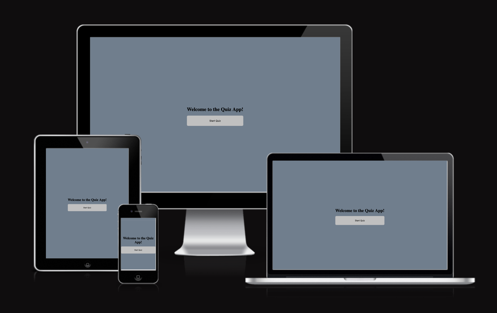
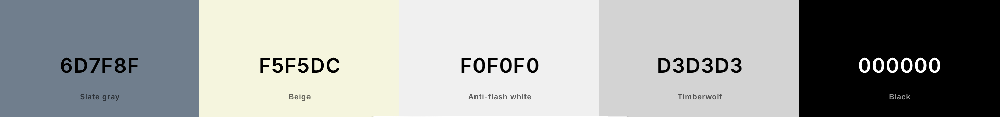
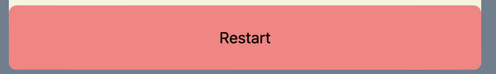

# Quiz App

Quiz App is a simple and interactive online game where users can test their knowledge by answering randomly selected questions. The application provides immediate feedback on the answers and keeps track of the user’s score, making it a fun way to learn and compete.

* [Link to Quiz App](https://tinagrigorova.github.io/Quiz-App/)

---

## User Experience (UX)

Quiz App provides an enjoyable and educational experience that challenges users to test their knowledge on various topics. With its simple interface and scoring system, this quiz is sure to keep users engaged and coming back for more.

### User Stories

* **First-time visitor goals**
    * Understand the main purpose of the website, which is a quiz game.
    * Start the quiz and understand the rules.
    * Receive feedback on their answers.

* **Returning visitor goals**
    * Improve their score.
    * Explore new features.
    * Check previous scores.

* **Frequent user goals**
    * Aim to achieve a perfect score.
    * Compete with others in their environment.
    * Explore new features.

  --- 
## DESIGN

### Colours

#### Primary colours used:

 

---

## Features

* **Main objective** is to provide an engaging platform for users to test and improve their knowledge on various topics.
* **Random question selection** to provide a unique experience each time the quiz is played.
* **Score tracking** to motivate users to improve.

### Existing Features

* **Start Page**
    * A clear and intuitive start page that prompts the user to begin the quiz.

    

* **Quiz Interface**
    * Displays the question and multiple-choice answers.

    

* **Score Display**
    * Shows the user's current score after each question.

    

* **Next and Reset Buttons**

    * Next button to move to the next question.

    

    * Reset button to start the quiz over.

    

 * **Footer**

    

### Features Left to Implement

* Additional question categories.
* Timer feature to add urgency to the game.
* User authentication for a personalized experience.

--- 
## FRAMEWORKS, PROGRAMS AND LIBRARYS USED 

 * [Github](https://github.com/)
    * To write and update the code.
 * [Git](https://git-scm.com/)
    * for vission control.
 * [Github](https://github.com/)
    * Deployment of the website and storing the files online.
* [Am I Responsive](https://ui.dev/amiresponsive)
    * Mockup picture for the README file.
---

## Technologies Used

* **HTML5** for structure.
* **CSS3** for styling.
* **JavaScript** for game logic.

---

## TESTING

### Manual testing

 * The website was tested on Safari and Microsoft Edge.
 * The website was viewed on a desktop computer, laptop, and Iphone 14 Pro Max mobile phone.
 * Large amount of testing was done to ensure links between pages are working correctly on all pages.
 * Dev Tools was used to test how the site looks on various screen sizes.

---
## DEPLOYMENT AND LOCAL DEVELOPMENT

### GitHub

* The site was deployed to GitHub pages.

 * Log in to GitHub and locate Github Repository [Quiz App](https://github.com/TinaGrigorova/Quiz-App.git)
 * At the top of the Repository(not the main navigation) locate "Settings" button on the menu.
 * Scroll down the Settings page until you locate "GitHub Pages".
 * Under "Source", click the dropdown menu "None" and select "Main" and click "Save".
 * The page will automatically refresh.
 * Scroll back to locate the now-published site link in the "GitHub Pages" section.

### Forking the GitHub Repository

By forking the repository, we make a copy of the original repository on our GitHub account to view and change without affecting the original repository by using these steps:

1. Log in to GitHub and locate [Quiz App](https://github.com/TinaGrigorova/Quiz-App.git)
2. At the top of the Repository(under the main navigation) locate "Fork" button.
3. Now you should have a copy of the original repository in your GitHub account.

### Local Clone

1. Log in to GitHub and locate [Quiz App](https://github.com/TinaGrigorova/Quiz-App.git)
2. Under the repository name click "Clone or download"
3. Click on the code button, select clone with HTTPS, SSH or GitHub CLI and copy the link shown.
4. Open Git Bash
5. Change the current working directory to the location where you want the cloned directory to be made.
6. Type `git clone` and then paste The URL copied in the step 3.
7. Press Enter and your local clone will be created.

--- 
